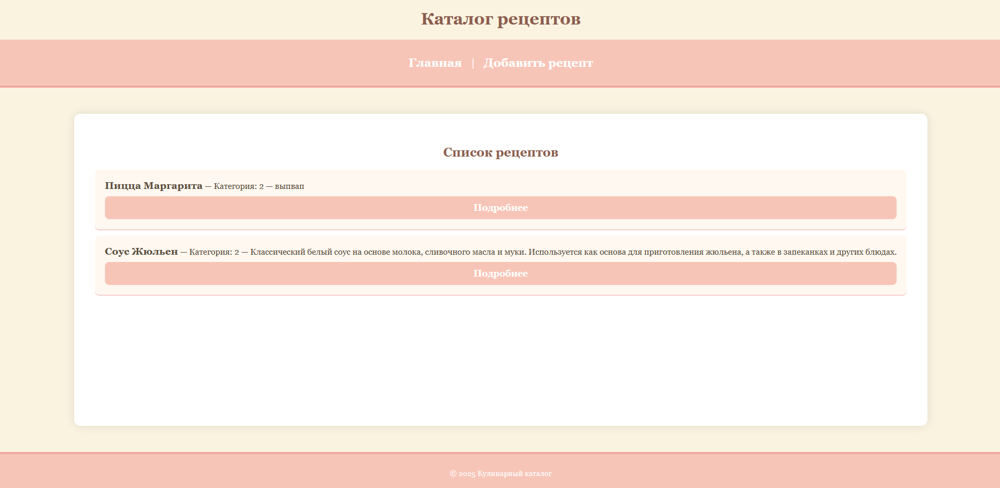
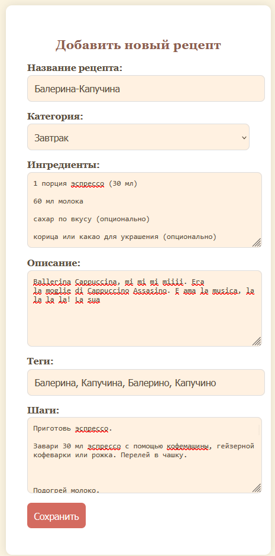
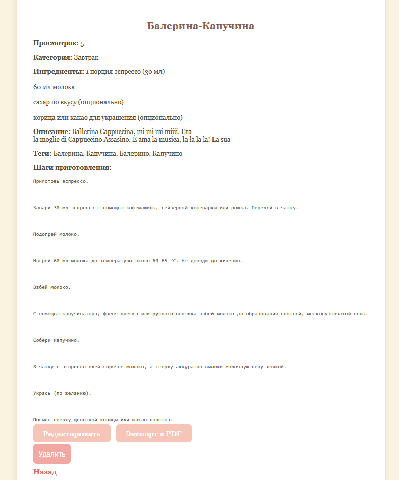
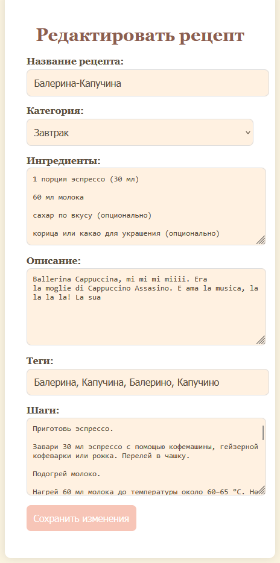
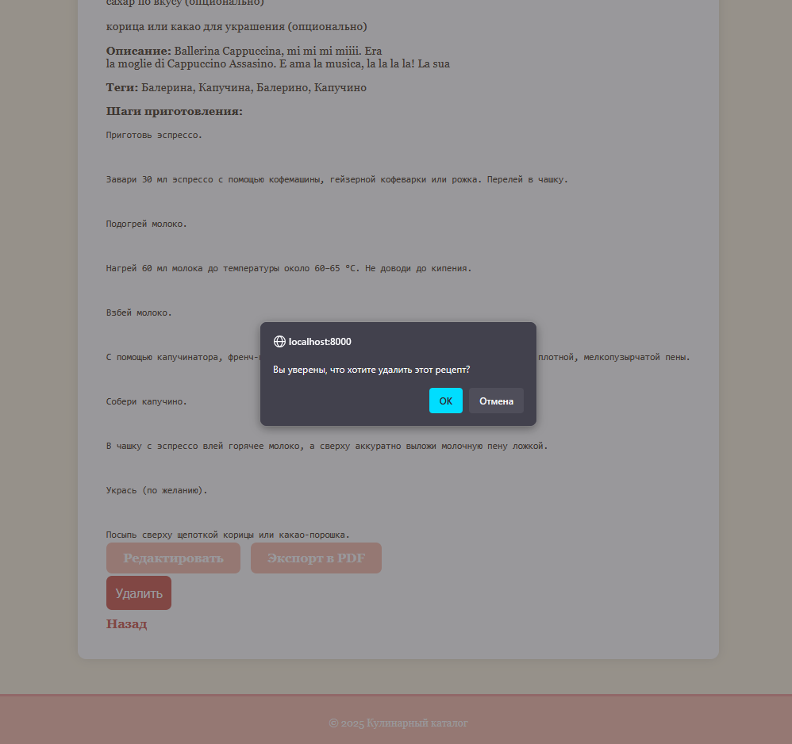
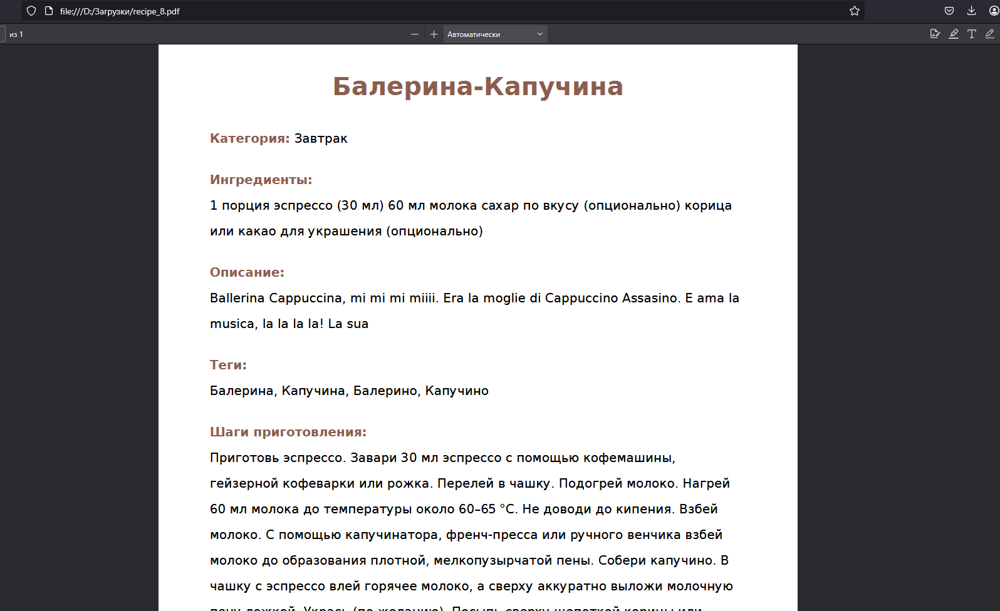

# Индивидуальная работа по СУБД: приложение Recipe Book
**Автор:** 
> *Чертков Владислав гр. IA2303*


## Инструкции по запуску проекта

### 1. Клонировать проект или скачать

Для начала необходимо клонировать проект с репозитория или скачать его архив.

```bash
git clone https://github.com/LuciferDevV/individualSGBD/tree/main/recipe-book
```

### 2. Создать базу данных `recipe_book`

Вам нужно создать базу данных для проекта, используя MySQL. Введите следующую команду в MySQL или используйте инструмент для работы с БД (например, phpMyAdmin):

```sql
CREATE DATABASE recipe_book;
```

### 3. Выполнить следующий SQL-скрипт для создания таблицы

Создайте таблицы для категорий и рецептов с помощью предоставленного SQL-скрипта.

```sql
CREATE TABLE categories (
  id INT AUTO_INCREMENT PRIMARY KEY,
  name VARCHAR(100) NOT NULL UNIQUE,
  created_at TIMESTAMP DEFAULT CURRENT_TIMESTAMP
);

CREATE TABLE recipes (
  id INT AUTO_INCREMENT PRIMARY KEY,
  title VARCHAR(255) NOT NULL,
  category INT NOT NULL,
  ingredients TEXT,
  description TEXT,
  tags TEXT,
  steps TEXT,
  created_at TIMESTAMP DEFAULT CURRENT_TIMESTAMP,
  FOREIGN KEY (category) REFERENCES categories(id) ON DELETE CASCADE
);

INSERT INTO categories (name) VALUES ('Завтрак'), ('Обед'), ('Ужин');
```

### 4. Настройка подключения к базе данных

Обновите данные подключения в файле `config/db.php`, указав правильные параметры для вашей базы данных:

```php
return [
    'host' => 'localhost',
    'port' => 3306,
    'dbname' => 'recipe_book',
    'user' => 'root',
    'pass' => 'rootpass',
];
```

### 5. Подключение Redis

Скачайте Redis например в папку `C:\redis`, из этой же папки запустите cmd и введите `redis-server` для запуска сервера Redis (не закрывайте cmd)

### 6. Composer

Скачайте Composer с оффициального сайта и установите

Далее из корня проекта пропишите

   ```bash
   composer install --no-dev
   ```
Флаг --no-dev исключает установку пакетов для разработки (если они есть).

если нет:

   ```bash
   composer install
   ```

### 7. Запуск приложения

в корневой папке приложения пропишите:

   ```bash
   php -S localhost:8000 -t public
   ```

## Описание индивидуальной работы

Этот проект представляет собой веб-приложение для управления кулинарными рецептами с полным набором функций:

### Основной функционал
- **CRUD-операции** с рецептами:
  - Создание новых рецептов
  - Чтение и просмотр деталей
  - Обновление существующих записей
  - Удаление рецептов

### Специальные возможности
1. **Экспорт в PDF**:
   - Генерация PDF-документа с полной информацией о рецепте
   - Автоматическое форматирование ингредиентов и шагов приготовления
   - Готовый к печати формат

2. **Система учета просмотров**:
   - Реализована на базе Redis для максимальной производительности
   - Автоматический подсчет количества просмотров каждого рецепта
   - Отображение статистики просмотров в PDF-экспорте

### Технологический стек
- **Backend**: PHP 8+
- **Базы данных**:
  - MySQL (основное хранилище рецептов)
  - Redis (для кеширования и подсчета просмотров)
- **Генерация PDF**: библиотека DomPDF
- **Frontend**: HTML5, CSS3, чистый PHP без фреймворков

### Особенности реализации
- Чистая архитектура MVC-паттерна
- Поддержка UTF-8 для корректного отображения кириллицы
- Адаптивный интерфейс для различных устройств

## Краткая документация к проекту

### Структура проекта:

* **public/** — главный каталог для веб-доступа, содержит файл `index.php`, который управляет маршрутами.
* **templates/** — хранит все шаблоны для отображения данных (список рецептов, создание рецепта, просмотр рецепта).
* **src/** — включает логику обработки данных (подключение к базе данных, обработка форм и запросов).
* **config/** — содержит конфигурационные файлы, такие как подключение к базе данных.

### Основные функции:

1. **Просмотр списка рецептов** — отображение всех рецептов с возможностью фильтрации по категориям.
2. **Создание рецепта** — форма для добавления новых рецептов в систему.
3. **Просмотр страницы определенного рецепта** - Возможность просмотреть полный рецепт с функционалом редактирования удаления и скачивания PDF. 
4. **Удаление рецепта** — возможность удаления рецепта.
5. **Редактирование рецепта** — возможность редактирования информации о рецепте.
6. **Сачивание PDF рецепта** - возможность экспорта полного рецепта в виде PDF файла.

### Примеры использования проекта:

1. **Просмотр всех рецептов на главной странице**:



2. **Добавление нового рецепта**:



3. **Просмотр полного рецепта, а так же счетчик просмотров**:



4. **Редактирование рецепта**:



5. **Удаление рецепта**:



6. **Результат экспорта в PDF**:



### Использование баз данных в проекте Recipe Book

#### 1. MySQL (основная база данных)
**Для чего используется:**
- Хранение структурированных данных рецептов и категорий
- Обеспечение целостности данных через связи между таблицами

**Реализация:**
1. **Структура таблиц**:
```sql
CREATE TABLE categories (
  id INT AUTO_INCREMENT PRIMARY KEY,
  name VARCHAR(100) NOT NULL UNIQUE,
  created_at TIMESTAMP DEFAULT CURRENT_TIMESTAMP
);

CREATE TABLE recipes (
  id INT AUTO_INCREMENT PRIMARY KEY,
  title VARCHAR(255) NOT NULL,
  category INT NOT NULL,
  ingredients TEXT,
  description TEXT,
  tags TEXT,
  steps TEXT,
  created_at TIMESTAMP DEFAULT CURRENT_TIMESTAMP,
  FOREIGN KEY (category) REFERENCES categories(id) ON DELETE CASCADE
);

INSERT INTO categories (name) VALUES ('Завтрак'), ('Обед'), ('Ужин');
```

2. **Примеры запросов**:
- Создание рецепта:
```php
$stmt = $pdo->prepare("INSERT INTO recipes (...) VALUES (...)");
```
- Получение рецептов с JOIN категорий:
```php
$stmt = $pdo->query("
    SELECT r.*, c.name AS category_name 
    FROM recipes r 
    JOIN categories c ON r.category = c.id
");
```

#### 2. Redis (дополнительная база данных)
**Для чего используется:**
- Подсчет количества просмотров рецептов
- Кеширование часто запрашиваемых данных

**Реализация:**
1. **Ключевые функции**:
```php
// Увеличение счетчика просмотров
$redis->incr("recipe:views:$recipeId");

// Получение количества просмотров
$views = $redis->get("recipe:views:$recipeId");
```

2. **Структура хранения**:
```
Ключ: "recipe:views:[ID_рецепта]"
Значение: [количество_просмотров]
```

#### 3. Взаимодействие баз данных
1. Основные данные (текст рецептов, категории) - хранятся в MySQL
2. Временные данные (счетчики просмотров) - в Redis
3. При экспорте в PDF система:
   - Берет основные данные из MySQL
   - Добавляет статистику просмотров из Redis

**Пример совместной работы**:
```php
// Получаем рецепт из MySQL
$recipe = $pdo->query("SELECT * FROM recipes WHERE id = $id")->fetch();

// Увеличиваем счетчик в Redis
$redis->incr("recipe:views:$id");

// Получаем количество просмотров
$views = $redis->get("recipe:views:$id");
```

#### Вывод
Проект демонстрирует эффективное использование двух различных СУБД:
- **MySQL** - как надежное основное хранилище
- **Redis** - как высокопроизводительное решение для временных данных и счетчиков

Такой подход позволяет:
1. Сохранить надежность хранения основных данных
2. Обеспечить высокую производительность для операций подсчета
3. Минимизировать нагрузку на основную БД
4. Легко масштабировать "горячие" участки системы

## Список использованных источников

1. [PHP Manual](https://www.php.net/manual/en/)
2. [MySQL Documentation](https://dev.mysql.com/doc/)
3. [PDO PHP Documentation](https://www.php.net/manual/en/book.pdo.php)
4. [Redis Documentation](https://redis.io/docs/latest/)
